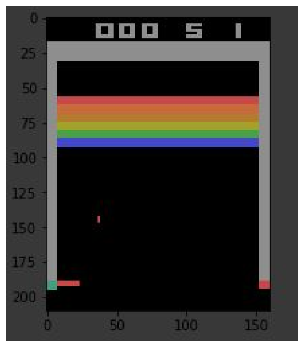
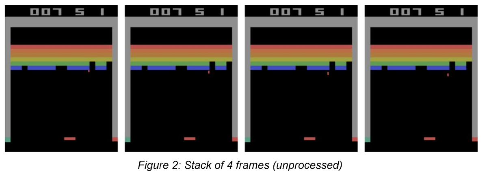
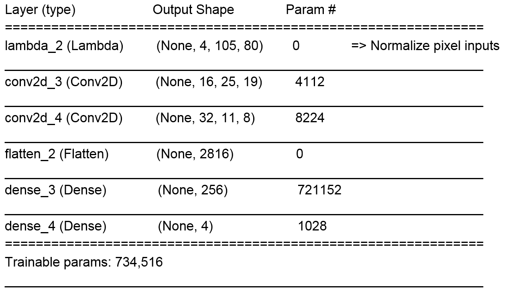
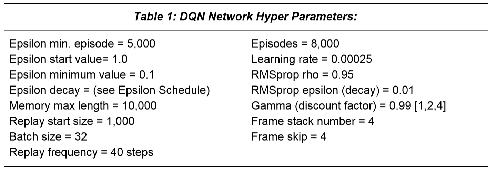
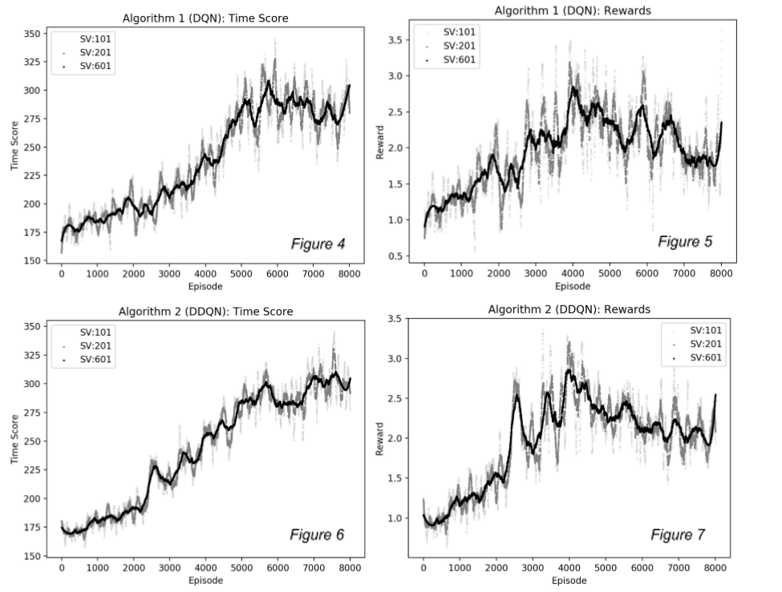

# DQN_DDQN_Atari_Breakout_Investigation
Comparing Double Q-Network and Dueling Double Q-Network with and without fixed targets for learning the Atari Breakout Domain (Project)
Please refer to the .pdf for the project paper. Some figures and tables are shown below for summary:

